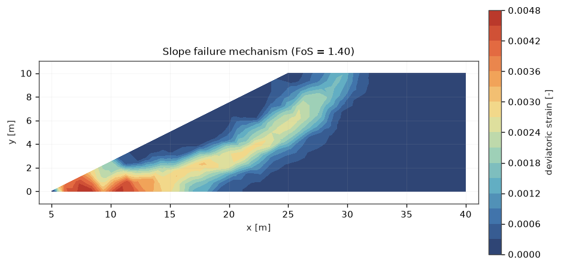
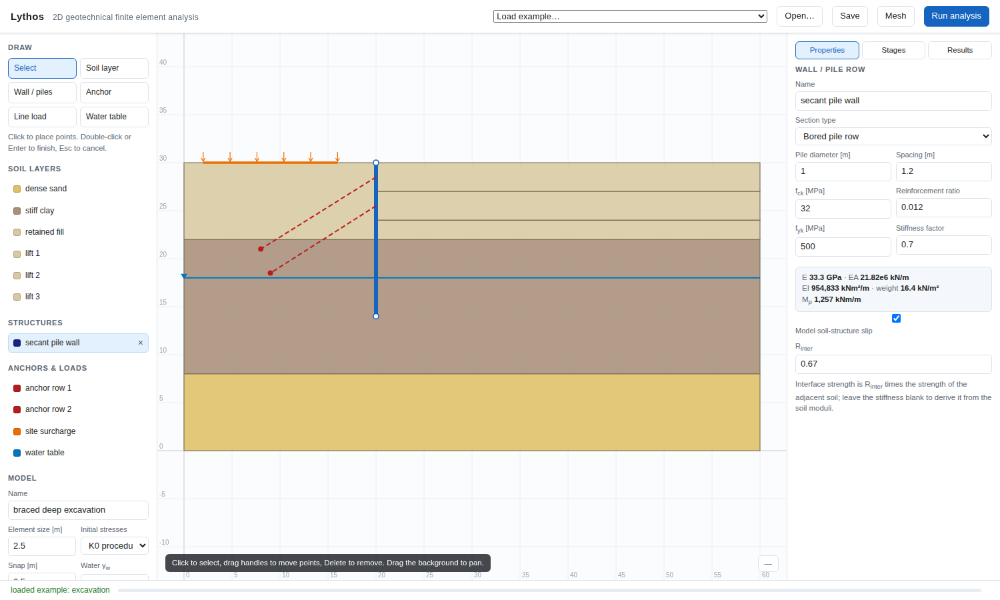
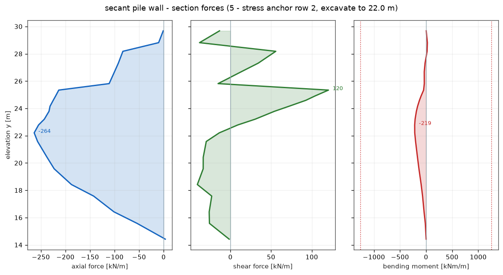

# Lythos

2D finite element analysis for geotechnical engineering: slopes, embankments and
deep excavations, with factors of safety by strength reduction and internal
forces in walls, piles and anchors.



Lythos covers the analyses a geotechnical engineer runs in practice:

- **Slope stability** — factor of safety by shear strength reduction, with the
  critical slip surface falling out of the deviatoric strain field rather than
  being assumed circular.
- **Staged construction** — embankments raised in lifts, excavations dug in
  stages, structures and anchors installed when they are built.
- **Retaining structures** — bored pile rows, diaphragm walls, sheet piles and
  linings, specified by diameter, spacing and concrete grade, reporting axial
  force, shear and bending moment along the member.
- **Soil-structure interaction** — Mohr-Coulomb interfaces with wall friction,
  pre-stressed ground anchors, struts and surcharge loads.
- **Groundwater** — hydrostatic pore pressure below a phreatic surface, with
  the horizontal pressure gradient carried as a seepage force.

Everything runs from an interactive interface in the browser, from the command
line, or as a Python script.

## Running it

Nothing needs installing. From a fresh clone:

```bash
python main.py
```

That opens the interface in your browser. `main.py` also takes the commands
below, so `python main.py run models/slope.json -o out` works the same as the
installed `lythos run ...`.

Python 3.10 or later, with NumPy, SciPy and Matplotlib. If any of those are
missing `main.py` says so and gives the command for your system rather than
failing with an import error.

Installing is optional and only buys you the shorter `lythos` command:

```bash
python -m venv .venv
source .venv/bin/activate        # fish: source .venv/bin/activate.fish
pip install -e .
```

A virtual environment is not a formality on Arch, Debian or Fedora: those
distributions refuse a system-wide `pip install` outright (PEP 668). If you
would rather use the system packages, `python -m venv --system-site-packages
.venv` lets the environment see a pacman- or apt-installed NumPy instead of
downloading its own.

## The interface

```bash
python main.py          # or: lythos gui
```

This starts a local server and opens the interface in your browser.  Draw the
soil layers, drop in a wall, set the construction stages, and press **Run
analysis**.



Nothing leaves your machine: the server listens on the loopback address only.
The interface runs in a browser rather than a desktop toolkit so that it works
the same over a remote session, in a container, or on a machine with no display.

## From a script

```python
from lythos.core.materials import MohrCoulomb
from lythos.core.model import Model, SoilLayer, Stage
from lythos.report import run_and_report

clay = MohrCoulomb(name="silty clay", E=1e5, nu=0.3, c=10.0, phi=20.0, gamma=20.0)
slope = [(0, 0), (40, 0), (40, 10), (25, 10), (5, 0)]

model = Model(
    name="cut slope",
    layers=[SoilLayer("silty clay", slope, clay, mesh_size=2.0)],
    stages=[
        Stage("1 - self weight", kind="initial"),
        Stage("2 - factor of safety", kind="ssr"),
    ],
    initial_stress="gravity",
)

summary = run_and_report(model, out_dir="out/slope")
print(summary["stages"][-1]["factor_of_safety"])      # 1.42 at this mesh size
```

`run_and_report` writes a self-contained HTML report with every figure
embedded, plus the numbers as JSON.

## From the command line

```bash
python main.py examples -o models      # write the worked examples as model files
python main.py mesh models/slope.json  # mesh statistics, without analysing
python main.py run models/slope.json -o out/slope
```

With the package installed, `lythos` replaces `python main.py` in each of
these.

## Specifying a pile wall

Piles are given the way they are designed, and the equivalent plate rigidities
follow:

```python
from lythos.core.pile import PileSection

piles = PileSection(diameter=1.0, spacing=1.2, fck=32.0,
                    rho_s=0.012, stiffness_factor=0.7)   # 0.7 for cracked bending
print(piles.describe())
# EA 21.8e6 kN/m, EI 954,800 kNm2/m, Mp 1257 kNm/m, weight 16.4 kN/m2
```

The concrete modulus comes from EN 1992-1-1 (`Ecm = 22000 (fcm/10)^0.3` MPa).
All structural output is per metre run of wall; divide by the spacing for the
force in one pile.



The steps in the shear diagram are at the anchor levels, where a point load
enters the wall.

## What is inside

| Part | What it does |
| --- | --- |
| `lythos.core.mesher` | Delaunay refinement mesher; planarises the drawing, honours every layer and structural line, grades element size per region |
| `lythos.core.materials` | Mohr-Coulomb with non-associated flow and a tension cut-off, linear elastic, concrete; exact return mapping in principal stress space |
| `lythos.core.elements` | 6-node triangles, Timoshenko beams, zero-thickness interfaces, anchors |
| `lythos.core.solver` | Staged construction, adaptive sub-stepping, strength reduction |
| `lythos.core.pile` | Pile and wall sections from diameter, spacing and concrete grade |
| `lythos.viz.plots` | Contours, deformed meshes, plastic points, section force diagrams |
| `lythos.gui` | The browser interface |

See [docs/theory.md](docs/theory.md) for the formulation and
[docs/validation.md](docs/validation.md) for what has been checked against what.

## Verification

Every claim below is a test in `tests/`:

| Check | Reference | Lythos |
| --- | --- | --- |
| Mohr-Coulomb failure deviator, plane strain | `σ1 = σ3 Kp + 2c√Kp` | within 0.5% |
| Active earth pressure, zero lateral strain | `Ka σv + 2c√Ka` | exact |
| Geostatic stress and settlement under self weight | `γz`, `γH²/2E` | exact |
| Patch test, linear displacement field | constant stress | exact to 1e-12 |
| Cantilever tip deflection | `PL³/3EI + PL/GA` | within 0.2% |
| Slender beam, h/L = 1/1000 | no shear locking | within 2% |
| 2:1 slope factor of safety | 1.377, independent Bishop search | 1.381 on a 471-element mesh |
| Algorithmic tangent | numerical derivative | within 4e-4 of E, everywhere |

```bash
pytest                    # the quick suite
pytest -m slow            # the full analyses as well
```

## Limitations

Worth knowing before trusting a number to a design:

- Drained or total-stress (undrained) analysis only; there is no consolidation,
  no transient flow and no coupled pore pressure. Undrained behaviour is
  modelled by giving a layer `phi = 0` and `c = su`.
- Pore pressure is hydrostatic below the phreatic surface. There is no seepage
  analysis, though the horizontal gradient of an inclined phreatic surface is
  carried as a seepage body force.
- Small strain throughout; no updated-mesh or large-displacement option.
- Elastic-perfectly plastic soil. There is no hardening model, so settlement
  predictions under working loads are only as good as the single stiffness
  chosen for the stress range that matters.
- A row of piles is smeared into an equivalent plate, which is the usual
  plane-strain idealisation; it says nothing about arching between the piles.
- Quadratic triangles are much better than linear ones under constant-volume
  plastic flow, but they are not immune to volumetric locking. Undrained
  (`phi = 0`) collapse loads are therefore slightly on the high side and get
  slower to converge as the plastic zone spreads. Refine, and treat an
  undrained factor of safety from a coarse mesh with particular suspicion.
- Strength reduction reports the factor at which equilibrium is lost. Like any
  such analysis it is sensitive to how the failure criterion is judged, so the
  displacement-versus-factor curve is reported alongside it and should be
  looked at.

## Licence

MIT.
