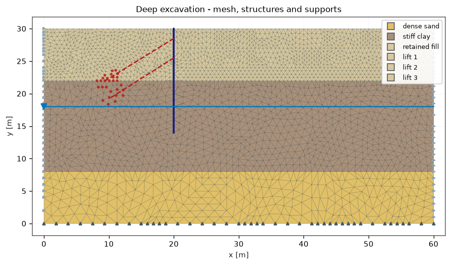
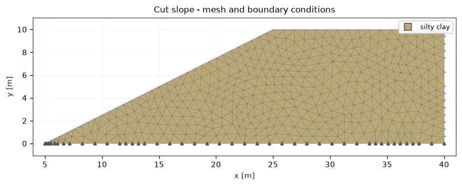

# Formulation

Units are kN, m and kPa throughout: stresses and strengths in kPa, unit weights
in kN/m³, forces per metre run of wall in kN/m and moments in kNm/m.

Stresses are **tension positive**, the continuum convention, and stored as the
four plane-strain components `[σxx, σyy, σzz, τxy]`. The out-of-plane component
is carried explicitly because plastic flow makes the out-of-plane elastic strain
non-zero even though the total strain there is zero, and because every yield
criterion depends on it. Results reported to the user follow soil mechanics
convention where that is clearer — `p'` is positive in compression.

## Importing a drawing

A section drawn in CAD is rarely one closed polygon per stratum. More often it
is an outer boundary plus the lines that divide it, drawn as separate entities
and sometimes on separate layers. Turning that into layers means recovering the
faces of the planar subdivision those lines make
(:mod:`lythos.core.topology`).

Each vertex orders its incident edges by direction; walking a face means
repeatedly taking the next edge clockwise from the one just arrived on. That
traverses every bounded region counter-clockwise and the unbounded outer region
clockwise, so discarding the negative-area walk leaves exactly the regions of
the drawing. Dangling lines that enclose nothing are traversed in both
directions and cancel.

A region is named after a closed input outline when one traces it exactly -
matched by area and centroid computed as polygon integrals, so that the match
survives planarisation adding vertices along an edge. Otherwise the name is a
guess from whichever drawing layer contributed most of the boundary, and the
import report says which names were guessed.

## Discretisation

Continuum elements are **6-node quadratic triangles** with three-point
integration. Constant-strain triangles were rejected: once a Mohr-Coulomb soil
flows plastically at constant volume they lock badly and overestimate collapse
loads, which would corrupt the factor of safety that the whole program exists to
compute.

Quadratic triangles are far better in that regime but not immune to it. With
`phi = 0` and `psi = 0` the plastic flow is exactly volume preserving, and the
element is then stiffer than it should be: undrained collapse loads come out
slightly high, and the iteration slows as the plastic zone spreads. A B-bar or
mixed formulation, or the 15-node triangle other codes use for this reason,
would remove it; neither is implemented here.

The mesh comes from a Delaunay refinement mesher (`lythos.core.mesher`):

1. The drawing is planarised — every crossing and every T-junction between the
   lines the user drew becomes a vertex, because a planar straight line graph
   may not contain crossings.
2. An incremental Bowyer-Watson triangulation of the input vertices, with
   geometric predicates evaluated under a static error filter and, where that
   cannot certify the sign, recomputed exactly in rational arithmetic.
3. Input segments are recovered by splitting them until each appears as a union
   of triangulation edges.
4. Triangles are labelled by testing their centroid against the layer outlines.
   Labelling by containment rather than by flood fill from a seed point is what
   keeps a soil layer correct when a wall or an excavation line cuts it into
   several disconnected pieces.
5. Refinement to a minimum angle and to per-region target sizes, splitting
   encroached segments in preference to inserting circumcentres.

Segment splitting is bounded below by a fraction of the target element size.
Without that bound, two boundary lines meeting at a sharp angle - the toe of a
slope, the shoulder of an embankment - send the refinement splitting the two
segments against each other without end, leaving elements orders of magnitude
smaller than the rest and a stiffness matrix to match. The minimum angle a
mesher can deliver is in any case limited by the angles in the input: where the
geometry itself has an 18 degree corner, no mesh will do better there.





## Constitutive models

### Mohr-Coulomb

Elastic-perfectly plastic, with non-associated flow and a tension cut-off. With
principal stresses ordered `σ1 ≥ σ2 ≥ σ3` (tension positive):

```
f = (σ1 − σ3) + (σ1 + σ3) sin φ − 2 c cos φ  ≤ 0
g = (σ1 − σ3) + (σ1 + σ3) sin ψ
σ1 ≤ σt                                       (tension cut-off)
```

with `σt = min(tension_cutoff, c cot φ)`. The cut-off is on by default at zero,
because real soil does not sustain the tension the apex of the cone implies.

Both criteria are linear in the principal stresses, so for any given set of
active surfaces the return is the solution of a small linear system:

```
σ = σ_trial − De B λ,     (Aᵀ De B) λ = Aᵀ σ_trial − k
D_alg = De − De B (Aᵀ De B)⁻¹ Aᵀ De
```

where the columns of `A` are the normals of the active surfaces and the columns
of `B` their flow directions. Which surfaces are active is found by trying the
candidate sets in order of size — the main face, a tension plane, an edge of the
pyramid, and the corners where a shear surface meets one or two tension planes —
and keeping the first that satisfies the loading-unloading conditions. That is a
search rather than a chain of geometric tests, which is what makes the corners
come out right; a geometric classification handles the faces but misplaces the
corners, leaving stresses outside the surface and the tangent wrong where the
soil is failing.

Returning to an **edge** needs care: intersecting the main face with `f(σ2, σ3)`
gives the edge `σ1 = σ2`, and with `f(σ1, σ2)` the edge `σ2 = σ3`, so the
criteria pair up the opposite way round from the violated inequality.

At the apex the material has no strength in any direction, so a token fraction
of the elastic stiffness is kept there to leave the global system solvable.

### Consistent tangent

The principal-space tangent is rotated into global axes by
`D = Tᵀ D_pr T` with `T` the strain rotation. Besides the principal stiffness,
the rotation of the principal directions contributes the shear term

```
D₁₂₁₂ = (σa − σb) / (2 (εa − εb))
```

which collapses to the shear modulus for an elastic step. Leaving it out costs
quadratic convergence wherever the material is plastic.

The tangent of non-associated flow is **unsymmetric**, and it is assembled and
solved that way. Symmetrising it — which halves the cost of a factorisation that
is not the bottleneck — costs Newton its convergence rate exactly where the soil
is failing.

### Other models

`LinearElastic` for rock and for checking. `Concrete` derives its modulus from
the characteristic cylinder strength following EN 1992-1-1,
`Ecm = 22000 (fcm/10)^0.3` MPa with `fcm = fck + 8`. An undrained layer is a
Mohr-Coulomb layer with `phi = 0` and `c = su`.

## Structural elements

**Beams** (walls, pile rows, linings) are 3-node quadratic Timoshenko elements
that share their translational nodes with a continuum element edge and own an
extra rotation at each node. The shear term is integrated at two points while
bending and axial terms use three; without that selective reduction a thin wall
locks and comes out far too stiff. Section forces are reported at the reduced
integration points, where the shear strain is accurate — read at the nodes
instead, the shear diagram zigzags from element to element and hides the real
distribution.

A pile row is smeared into an equivalent plate: every rigidity is divided by the
out-of-plane spacing, giving EA in kN/m, EI in kNm²/m and self weight in kN/m².

**Interfaces** are zero-thickness quadratic elements with three node pairs. Where
a structure has an interface the mesh is split along it into three sets of
coincident nodes — the soil on either side and the structure itself — with an
interface element between each pair. Elements that touch the line at only one
node, around the toe of a wall, keep the original node, so the soil stays
continuous where it wraps round the end.

The contact is incremental elasto-plastic:

```
tn = tn_committed + kn Δdn,   ts = ts_committed + ks Δds
|ts| ≤ c_i − tn tan δ         (tn ≤ 0 in contact)
tn ≤ tensile                  (otherwise the gap opens)
```

Strength defaults to `tan δ = R_inter tan φ'` and `c_i = R_inter c'` of the
adjacent soil; stiffness defaults to `kn = E_oed / t_v` with a virtual thickness
`t_v` a small fraction of the local element size.

Two details matter for convergence. While a point slides, the shear traction is
set by the normal traction, so the tangent needs the coupling term
`∂τ/∂σn = −sign(τ) tan δ · kn`; it is around a thousand times larger than the
residual shear stiffness, and leaving it out stalls the iteration however small
the load step. And a point that keeps switching between sticking and sliding
from one iteration to the next leaves a pair of equal and opposite residuals
that no step size removes, so the contact states are frozen once the iteration
stops making progress and released at the next increment.

Before its structure is installed, an interface acts as a rigid tie: the node
pairs exist in the mesh from the first stage, and without the tie the soil would
be split along the future wall line from the start.

**Anchors** connect a node on the structure to a grout body — a weighted set of
nodes spanning the fixed length — because tying a ground anchor to a single node
lets the anchorage be dragged through the mesh and the pre-stress bleeds away.
While an anchor is being stressed its force is what the jack sets, so it acts as
a prescribed force rather than as an elastic bar; afterwards it keeps that force
and responds elastically about the length it was locked off at.

## Effective stress and water

Working in effective stress, equilibrium reads

```
∇·σ' + b − ∇p = 0
```

so the body force on the soil skeleton is `b − ∇p`. Below a horizontal phreatic
surface that is simply the buoyant unit weight; where the surface is inclined,
the horizontal part of `∇p` is the seepage force and it is included. Pore
pressure is hydrostatic below the phreatic surface — there is no flow analysis.

## Initial stresses

- **K0 procedure** integrates the unit weight of the layers above each Gauss
  point and sets `σ'h = K0 σ'v`, with `K0 = 1 − sin φ'` (Jaky) unless given. The
  solver then irons out the out-of-balance this leaves where the ground is not
  horizontal.
- **Gravity loading** applies self weight to the elastic-plastic soil in
  increments. This is the honest choice for a slope, but note that it produces
  `K0 = ν/(1−ν)`, which for a low friction angle can be *below* the active limit
  `Ka`; the soil then yields everywhere on the first step, correctly but
  unhelpfully. Raise Poisson's ratio or use the K0 procedure if that happens.

## Solving

Each stage ramps from the internal force of the current state to the target load
of the new configuration. Increments adapt: one that will not converge is retried
at half the size rather than abandoning the stage, and a Newton step that cannot
reduce the imbalance at any step length cuts the increment instead of diverging.
A backtracking line search covers the non-associated tangent.

Deactivating a layer removes it from both the internal force and the body force;
the stresses on the new free surface then relax over the increments, which is the
excavation release.

A structure is built into ground that has already moved, so its section forces
are measured from the displacement field at the moment of installation.

## Strength reduction

`c'` and `tan φ'` are divided by a trial factor and the whole non-linear problem
re-solved. The factor of safety is the largest factor for which an equilibrium
state still exists; past it the deforming zone links up into a mechanism,
displacements run away, and the iteration stops converging.

Trials march upward from the lower bound and then bisect, each starting from the
previous converged trial rather than from the original state. That halves the
work and makes the displacement-versus-factor curve meaningful, because it traces
one continuous loading path instead of a set of unrelated solutions. Warm
starting also removed a 20% mesh dependence that cold-started trials showed.
