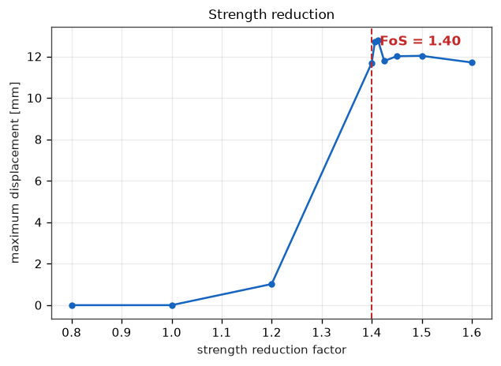

# Validation

Every figure here is produced by a test in `tests/`. Run them with

```bash
pytest            # the quick checks
pytest -m slow    # the full analyses as well
```

## Constitutive model

| Check | Reference | Lythos | Test |
| --- | --- | --- | --- |
| Failure deviator, plane strain compression, c' = 10 kPa, φ' = 30° | `σ1 = σ3 Kp + 2c√Kp` | within 0.5% | `test_mohr_coulomb_failure_deviator` |
| Failure deviator, φ = 0, su = 40 kPa | `q = 2 su` | within 0.5% | `test_tresca_failure_deviator` |
| Active state under zero lateral strain | `σh = Ka σv + 2c√Ka` | exact | `test_materials.py` oedometer path |
| Elastic step with strength removed | Hooke's law | exact to 1e-10 | `test_elastic_step_reproduces_hookes_law` |
| No returned stress outside either criterion | `f ≤ 0`, `σ1 ≤ σt` | to 1e-13 | `test_yield_surface_never_violated` |
| Algorithmic tangent vs numerical derivative | — | within 4e-4 of E at every plastic point | `test_algorithmic_tangent_is_consistent_everywhere` |
| Concrete modulus | EN 1992-1-1 Table 3.1 | within rounding | `test_concrete_modulus_en1992` |

The tangent and admissibility checks run over random stress states with tension
cut-offs of 0, 5 kPa and none, and friction angles of 0°, 30° and 35° with both
associated and non-associated flow.

## Elements

| Check | Reference | Lythos | Test |
| --- | --- | --- | --- |
| Patch test: linear displacement field prescribed on the boundary | constant stress throughout | exact to 1e-12 | `test_patch_test_reproduces_a_linear_displacement_field_exactly` |
| Rigid body translation | no strain energy | exact | `test_element_stiffness_is_symmetric...` |
| Cantilever tip deflection | `PL³/3EI + PL/GA` | within 0.2% | `test_cantilever_tip_deflection_matches_beam_theory` |
| Cantilever root moment | `PL` | within 2% | `test_cantilever_root_moment_matches_statics` |
| Slender beam, h/L = 1/1000 | no shear locking | within 2% of `PL³/3EI` | `test_thin_beam_does_not_lock` |

## Mesh generation

Layer areas are reproduced **exactly** (to 1e-12 relative) for a square, a
square with a hole, a two-layer slope, and a layer cut into two by an internal
wall line. Minimum element angles exceed 24°, every element is
counter-clockwise with positive area, midside nodes sit at edge midpoints, and
the triangulation passes a full topology check (neighbour links reciprocated,
shared edges consistent). Lines drawn crossing one another are planarised, and
the crossing point becomes a node.

## Whole analyses

| Check | Reference | Lythos | Test |
| --- | --- | --- | --- |
| Geostatic vertical stress under self weight | `σv = γ z` | exact | `test_gravity_gives_the_exact_geostatic_stress_and_settlement` |
| Settlement of a confined elastic column | `γH²/2E` | exact | as above |
| Effective stress below the water table | `γ(H−hw) + γ' (hw−z)` | within 0.3% | `test_buoyancy_reduces_the_effective_stress_by_the_water_pressure` |
| Earth pressure at rest | `σh = K0 σv` | within 0.03 in K0 | `test_earth_pressure_at_rest_follows_k0` |
| Excavation unloads the ground below | `σv = γ z` below the new surface, heave upwards | exact | `test_deactivating_a_layer_removes_its_weight` |

The buoyancy check is not exact because the phreatic surface is resolved at the
Gauss points, so an element straddling it carries a slightly wrong weight. The
error is second order and shrinks with the mesh.

## Slope factor of safety

The benchmark is a 2:1 cut slope, 10 m high, `c' = 10 kPa`, `φ' = 20°`,
`γ = 20 kN/m³`, on a rigid base at toe level.

An independent Bishop simplified search over circular slip surfaces — written
separately, not sharing any code with the finite element solver, and constrained
to circles that stay above the rigid base — gives

```
FoS = 1.377   centre (8.0, 24.0), radius 24.0 m
```

Strength reduction converges to **1.39 to 1.40**, within 1 to 2% of the
circular-surface result. The
two should not agree exactly: strength reduction finds whatever surface is
critical rather than the best circle available.

The failure mechanism falls out of the deviatoric strain field, and it runs from
the crest through the slope to the toe, matching the critical circle the limit
equilibrium search found:


### Mesh convergence

| Target element size | Elements | Factor of safety |
| --- | --- | --- |
| 3.0 m | 129 | 1.475 |
| 2.5 m | 167 | 1.438 |
| 2.0 m | 244 | 1.400 |
| 1.6 m | 348 | 1.400 |
| 1.3 m | 499 | 1.387 |

Refining reduces the factor of safety towards a limit, and by less each time:
the answer settles at 1.39 to 1.40, within 1% of the independent limit
equilibrium result. The direction is the expected one - a coarse mesh cannot
resolve the shear band, so it makes the slope look stronger than it is.
**A strength reduction result from a coarse mesh is unconservative**: refine
until the answer stops moving, and treat a single coarse run as an upper bound.

The displacement-versus-factor curve is reported with every strength reduction
analysis, and should be inspected: the knee is what confirms a mechanism has
formed rather than the solver merely having given up.



## Deep excavation

The braced excavation example — 8 m deep in three lifts, 16 m secant pile wall
of 1.0 m piles at 1.2 m centres, two rows of pre-stressed anchors — produces:

| Stage | Wall top [mm] | M max [kNm/m] | Anchor 1 [kN] | Anchor 2 [kN] |
| --- | --- | --- | --- | --- |
| install wall | −0.7 | 28 | — | — |
| excavate to 3 m | 1.2 | 83 | — | — |
| stress row 1, dig to 6 m | −1.3 | 164 | 350 | — |
| stress row 2, dig to 8 m | 1.3 | 219 | 306 | 450 |

Each anchor reaches exactly its lock-off load in the stage it is stressed and
then relaxes as the dig continues, the wall top is held within a couple of
millimetres once propped, and the moment stays at 17% of the 1257 kNm/m
capacity of the section. The largest movement is 72 mm of heave at the base of
the excavation, not wall deflection — which is what a heavily propped wall in
stiff clay should do.

## What has *not* been validated

- No comparison against measured field data.
- No comparison against another commercial finite element program.
- Consolidation, transient flow and large displacement are not implemented at
  all, so there is nothing to validate.
- The plastic moment estimate for a bored pile is a first-order formula
  (steel as a thin ring at 0.4 D lever arm); use a measured section capacity
  for design.
